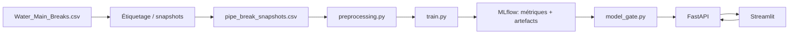

# Architecture

## Vue d'ensemble

## Composants

### Données et préparation

`src/labeling.py` produit des snapshots et les cibles par horizon. `src/preprocessing.py` nettoie les données, calcule les variables temporelles et interdit les fuites de données.

### Entraînement

`src/train.py` construit les pipelines de prétraitement et entraîne les familles de modèles. Les runs sont enregistrés dans MLflow.

### Model Gate

`src/model_gate.py` filtre les runs MLflow : il exclut les essais Optuna imbriqués, exige les métriques requises et un artefact de modèle, puis sélectionne le champion au meilleur PR-AUC parmi les modèles non surappris.

### Inférence

`api/main.py` charge le champion à partir de MLflow et expose les endpoints de prédiction. Il gère les modèles scikit-learn, H2O et pyfunc.

### Interface

`app/streamlit_app.py` affiche les informations du champion, construit le payload de prédiction et appelle l'API.

## Décision de déploiement

Docker Compose orchestre les quatre services sur une seule VM Oracle Cloud pour une démonstration et un déploiement pédagogique simples.
